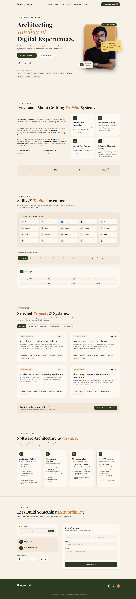

# Rampravesh | Full Stack • Mobile • AI Developer Portfolio

[](https://rampraveshkumar.vercel.app/)
[](https://github.com/Rampravsh)

A modern, high-performance, editorial portfolio website showcasing full-stack web applications, cross-platform mobile apps, AI workflows, and software architecture principles. 

🌐 **Live Demo**: [https://rampraveshkumar.vercel.app/](https://rampraveshkumar.vercel.app/)

Built with **Next.js 16 (App Router)**, **React 19**, **TypeScript**, **Tailwind CSS v4**, and **Framer Motion**.



---

## 🌟 Key Features & Sections

### 1. 🚀 Hero Section
- **Architecting Intelligent Digital Experiences**: Clean headline with Playfair Display serif & Manrope typography.
- **Featured Tech Badges**: Quick view of top skills (React, Next.js, React Native, TypeScript, Node.js, FastAPI, Spring Boot, MongoDB, PostgreSQL, Redis, Docker, OpenAI, OpenCV, NumPy).
- **Interactive Action Buttons**: Direct links to "Let's Build Together", "Explore Projects", and "Download Resume".

### 2. 🧠 Engineering Philosophy & About Me
- **Core Pillars**:
  - **Full-Stack Web Engineering**: React, Next.js, Node.js, Express, Tailwind CSS.
  - **AI & Machine Learning**: OpenAI API, Gemini API, MediaPipe, OpenCV, NumPy.
  - **Mobile & Real-Time Apps**: React Native, Expo Router, WebSockets, Socket.IO.
  - **Software Architecture & Security**: Clean Architecture, MVC, JWT, RBAC, Database Indexing.
- **Live Stats Strip**: 3+ Years Experience, 20+ Completed Projects, 15+ Tech Stack Mastered, 100% Code Precision.

### 3. 🛠️ Skills & Tooling Inventory
- **⭐ Top 20 Featured Highlight Skills Grid**: Custom colored tech badges for core frameworks and tools.
- **9 Domain-Specific Filter Tabs**:
  - Languages (JS, TS, Python, Java, C++, SQL, HTML5, CSS3)
  - Frontend (React, Next.js, React Native, Expo, Vite, Tailwind, Redux, Three.js, Electron.js)
  - Backend & APIs (Node.js, Express, FastAPI, Spring Boot, WebSockets, Socket.IO, JWT)
  - Databases (MongoDB, PostgreSQL, Redis, MySQL, SQLite, Indexing)
  - AI & Machine Learning (OpenAI API, Gemini API, Prompt Eng, OpenCV, MediaPipe, NumPy)
  - Mobile Dev (React Native, Expo Router, Push Notifications, Deep Linking)
  - Cloud & DevOps (Docker, Git, GitHub Actions, Firebase, Supabase, Vercel, Linux)
  - Security & Real-Time (Socket.IO, JWT, Password Hashing, Rate Limiting, CORS)
  - Currently Learning (Kubernetes, AWS, CI/CD, Microservices, GraphQL, Kafka, R3F, Prisma, tRPC)

### 4. 💼 Featured Real Projects
Each project card includes live repository links, detailed descriptions, technology tags, and category badges:
1. **Easy Ride - Taxi Booking App Platform** (`React Native`, `React.js`, `Node.js`, `Express`, `MongoDB`, `Socket.IO`, `Google Maps API`)
   - Industrial-grade ride-hailing ecosystem comprising Customer Mobile App, Driver/Rider App, and Admin Web Management Dashboard.
2. **PragyaOS - Next-Level LMS Platform** (`Next.js`, `React.js`, `TypeScript`, `Node.js`, `Express`, `MongoDB`, `Tailwind CSS`)
   - Full-stack EdTech Learning Management System with course creation, video streaming, student analytics, and quiz engines.
3. **Cricket - Real-Time Live Scoring Application** (`React.js`, `Node.js`, `Express`, `Socket.IO`, `WebSockets`, `MongoDB`)
   - High-throughput WebSocket application for ball-by-ball scoring updates and live scoreboard synchronization.
4. **Air-Writing - Computer Vision Gesture Recognition** (`Python`, `OpenCV`, `MediaPipe`, `NumPy`, `Machine Learning`)
   - Real-time computer vision gesture application for virtual air-canvas drawing and fingertip tracking.

### 5. 📐 Software Architecture & CS Core
- **Architecture Patterns**: Clean Architecture, MVC, Feature-Based & Modular Design, RESTful APIs, Monorepo.
- **Performance Engineering**: Code Splitting, Lazy Loading, Next.js Image Optimization, Bundle Optimization, Caching.
- **CS Fundamentals**: Data Structures & Algorithms, OOP, Functional Programming, Operating Systems, Computer Networks.
- **Tools & Workflow**: VS Code, Cursor, Postman, Bruno, Figma, Chrome DevTools, ESLint, Docker, Git Flow.

### 6. 📄 Printable PDF Resume Page (`/resume`)
- Dedicated `/resume` route featuring profile image, executive summary, work history, active links, and a 1-Click **"Print / Save as PDF"** button.

### 7. 📩 Interactive Contact Section
- Direct Email link & 1-Click Email Copy for `rampraveshkr4545@gmail.com`.
- Mailto-integrated contact form opening pre-filled email drafts upon submission.

---

## 💻 Tech Stack

| Domain | Technology |
| :--- | :--- |
| **Framework** | Next.js `16.2.12` (App Router & Turbopack) |
| **Library** | React `19.2.4` |
| **Language** | TypeScript `5.x` |
| **Styling** | Tailwind CSS `v4` |
| **Animations** | Framer Motion `12.43.0` |
| **Icons** | Lucide React, React Icons (`Fa6`, `Si`) |

---

## ⚡ Getting Started & Local Setup

### Prerequisites
Make sure Node.js `v18+` or `v20+` is installed on your system.

### 1. Clone the repository
```bash
git clone https://github.com/Rampravsh/Portfolio-Website-
cd p2
```

### 2. Install dependencies
```bash
npm install
```

### 3. Run development server
```bash
npm run dev
```
Open [http://localhost:3000](http://localhost:3000) in your browser to view the application.

### 4. Build for Production
```bash
npm run build
npm run start
```

---

## 📂 Project Structure

```text
p2/
├── .github/
│   └── workflows/
│       ├── ci.yml             # Automated GitHub Actions CI Pipeline
│       └── deploy-vercel.yml  # Automated Vercel Deployment Workflow
├── app/
│   ├── globals.css            # Tailwind v4 import & font variables
│   ├── icon.svg               # Custom brand SVG favicon
│   ├── layout.tsx             # Root layout with fonts & metadata
│   ├── page.tsx               # Main portfolio page assembly
│   └── resume/
│       └── page.tsx           # Printable PDF resume page
├── components/
│   ├── Navbar.tsx             # Sticky glassmorphic navbar & drawer
│   ├── Hero.tsx               # Hero banner & highlight skill strip
│   ├── About.tsx              # Engineering philosophy & stats counter
│   ├── Skills.tsx             # Featured skills grid & 9 domain tabs
│   ├── Projects.tsx           # Filterable project showcase & GitHub CTA
│   ├── TechStack.tsx          # Architecture, CS core, & dev tools
│   ├── Contact.tsx            # Interactive contact form & email copy
│   └── Footer.tsx             # Footer with back-to-top navigation
├── public/
│   ├── icon.svg               # Favicon asset
│   └── images/
│       └── profile.png        # Profile photo asset
├── vercel.json                # Vercel configuration
├── package.json
└── tsconfig.json
```

---

## ⚙️ CI/CD Pipeline & Vercel Deployment

This project includes automated Continuous Integration and Continuous Deployment (CI/CD) using **GitHub Actions** and **Vercel**:

### 1. 🔄 Continuous Integration (`ci.yml`)
- Triggered on every `push` or `pull_request` to `main` or `master`.
- Installs dependencies, performs TypeScript compilation, and verifies `next build` to ensure zero production build errors before code is merged.

### 2. 🌐 Vercel Deployment Guide
To host this portfolio live on Vercel:
1. Push your repository code to GitHub (`https://github.com/Rampravsh/Portfolio-Website-`).
2. Go to [Vercel Dashboard](https://vercel.com/dashboard) -> **Add New Project**.
3. Select your GitHub repository (`Portfolio-Website-`).
4. Keep framework as **Next.js** and click **Deploy**.
5. Vercel will automatically build and assign a free custom SSL domain (e.g. `your-portfolio.vercel.app`) with automatic deployments on every Git push!

---

## 📬 Connect with Me

- **Email**: [rampraveshkr4545@gmail.com](mailto:rampraveshkr4545@gmail.com)
- **GitHub**: [github.com/Rampravsh](https://github.com/Rampravsh)
- **Instagram**: [instagram.com/dream.coder__](https://www.instagram.com/dream.coder__?igsh=cGp3azRlaHlucG1h)

---
*Created with passion by Rampravesh.*
